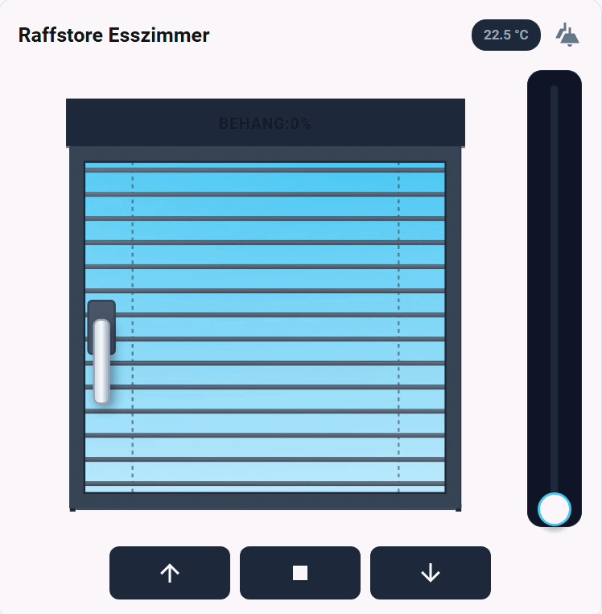
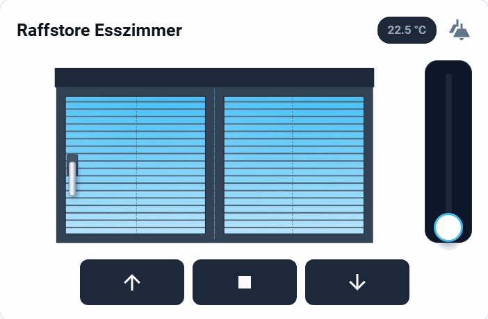
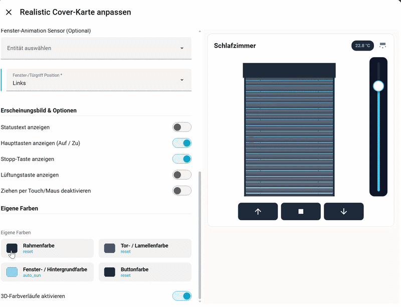
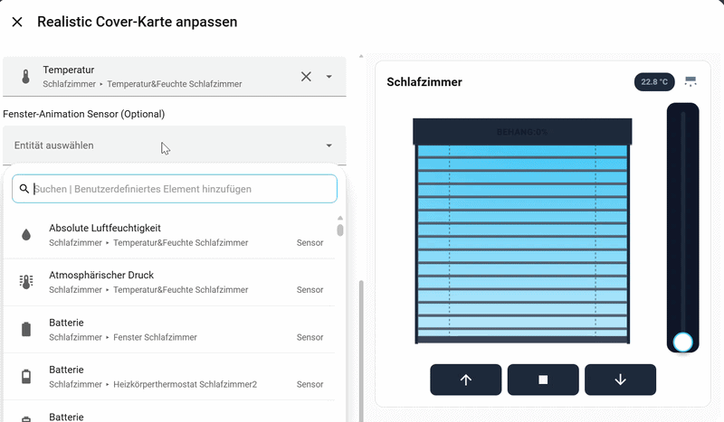
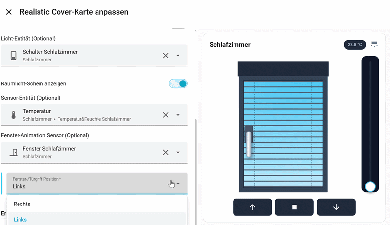
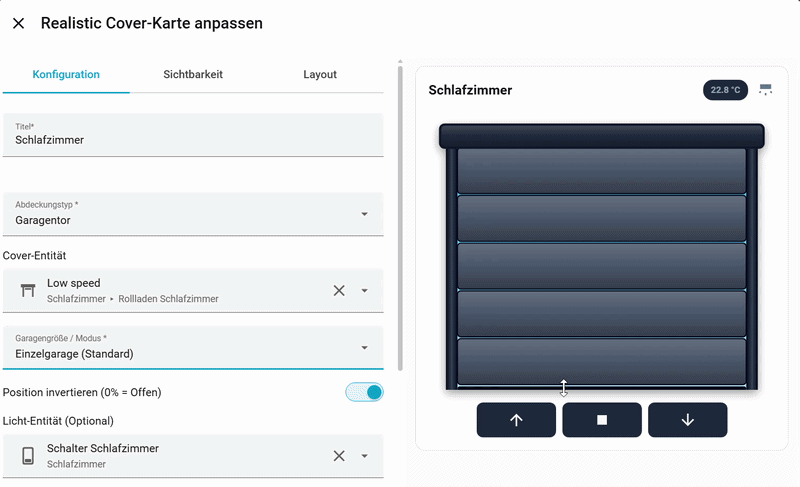
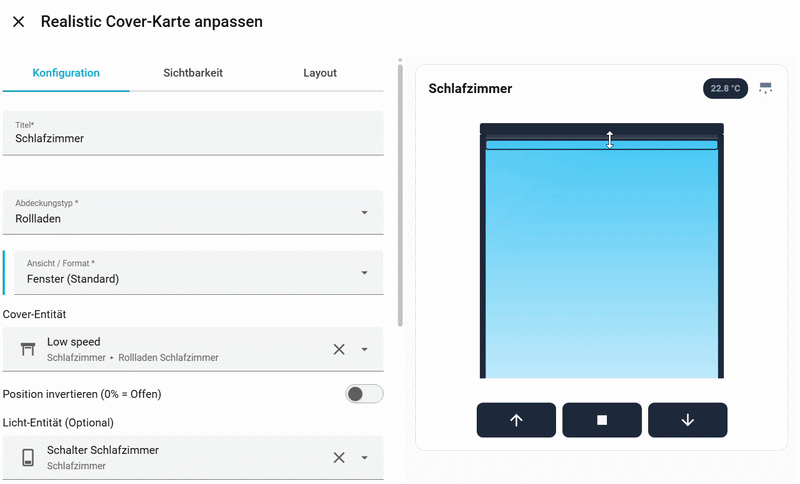
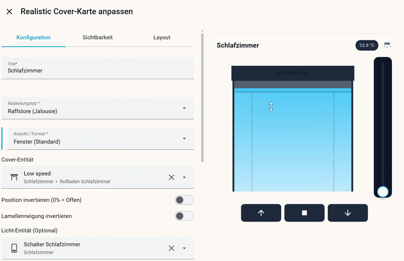

# Realistic Cover Card for Home Assistant

A high-quality, interactive, and animated custom card for Home Assistant to control roller shutters, venetian blinds, and garage doors.

The card uses advanced SVG rendering to display the current state and movement of your covers in real-time, and reacts dynamically to your environment (e.g., sun position and room lighting).

If you enjoy this project and want to support my work, I'd appreciate a coffee! ☕
<script type="text/javascript" src="https://cdnjs.buymeacoffee.com/1.0.0/button.prod.min.js" data-name="bmc-button" data-slug="MBPProjects" data-color="#FFDD00" data-emoji=""  data-font="Cookie" data-text="Buy me a coffee" data-outline-color="#000000" data-font-color="#000000" data-coffee-color="#ffffff" ></script>

## 🎬 Model Preview

Here are the different display options of the card. **New:** Roller shutters and venetian blinds are now available in different versions as a standard window, door, and sliding door, including new window animations and various garage modes!

| Garage Door | Roller Shutter | Venetian Blind |
|:---:|:---:|:---:|
|  |  |  |

| Window | Sliding Door |
|:---:|:---:|
|  |  |

## 🛠️ Editor Settings & Features

All new features can be configured directly in the visual editor. Here is a glimpse of the various setting options:

- **General Color Selection:**
  

- **Window & Window Handle Features:**
  
  

- **Specific Cover Features:**
  * **Garages:** 
  * **Roller Shutters:** 
  * **Venetian Blinds:** 


## ✨ Features

- **Extended Supported Types:** Garage door (various modes), roller shutter, and venetian blind (incl. slat tilt) – each customizable as a window, door, or sliding door.
- **Interactive Control:** Swipe (drag) the cover directly in the graphic up and down to adjust the position.
- **Window Animations:** New, smooth animations for opening and closing windows and doors.
- **Dynamic Sun Background:** The card automatically reads the `sun.sun` entity. The sky in the window background smoothly transitions from bright blue (day) to orange (dusk) to dark blue/black (night).
- **Room Light Reflection (Glow):** Link a light entity to the card. When the light is on in the room, a warm "glow" reflects in the window glass.
- **More-Info Dialog:** Clicking on the card opens the standard settings dialog of the cover entity.
- **Customizable Buttons:** Show or hide main buttons (Up/Down), a stop button, and a dedicated vent button (with a definable target position) as you like.
- **Visual Editor:** Full integration into the Home Assistant Card Picker UI editor. No YAML code is strictly required!
- **100% Customizable:** Change the colors of the frame, cover, window background, and buttons, or toggle the 3D shadow effect.

## 📦 Installation (via HACS)

1. Open Home Assistant and navigate to **HACS** > **Frontend**.
2. Click on the three-dot menu in the top right corner and select **Custom repositories**.
3. Paste the URL of this repository and select the category **Lovelace**.
4. Click on **Add**.
5. Search for *Realistic Cover Card* in HACS and click **Download**.
6. Reload your dashboard (or clear your browser cache).

## ⚙️ Configuration

You can easily add the card via the visual editor in Home Assistant. Simply select **"Realistic Cover"** from the list when adding a new card.

### Editor Options

- **Title:** The heading of the card.
- **Main Entity:** Your `cover.*` entity.
- **Cover Type:** Choose between *Garage Door*, *Roller Shutter*, and *Venetian Blind* (as well as the new window/door variants).
- **Invert Position / Tilt:** If your entity interprets 0% as "Open", you can reverse this behavior here.
- **Light / Switch (Optional):** For the room light reflection in the window.
- **Sensor / Contact (Optional):** Displays the status of an additional window or door contact as a small text badge.
- **Visibility:** Toggle status texts, Up/Down buttons, stop buttons, or the vent button individually.
- **Disable Drag Control:** Disables swiping in the graphic if you only want to use the buttons.
- **Colors:** Individual color pickers for the frame, cover, window, and buttons, including a reset function. If the window color is set to default (empty), the sun's sky color gradient applies automatically.

### Manual YAML Configuration (Optional)

If you prefer YAML, here is an example code:

```yaml
type: custom:realistic-cover-card
entity: cover.wohnzimmer_ost
title: Wohnzimmer Ost
cover_type: shutter
light_entity: light.wohnzimmer_decke
sensor_entity: binary_sensor.fensterkontakt_ost
show_stop_button: true
show_vent_button: true
vent_percentage: 15
use_3d_colors: true