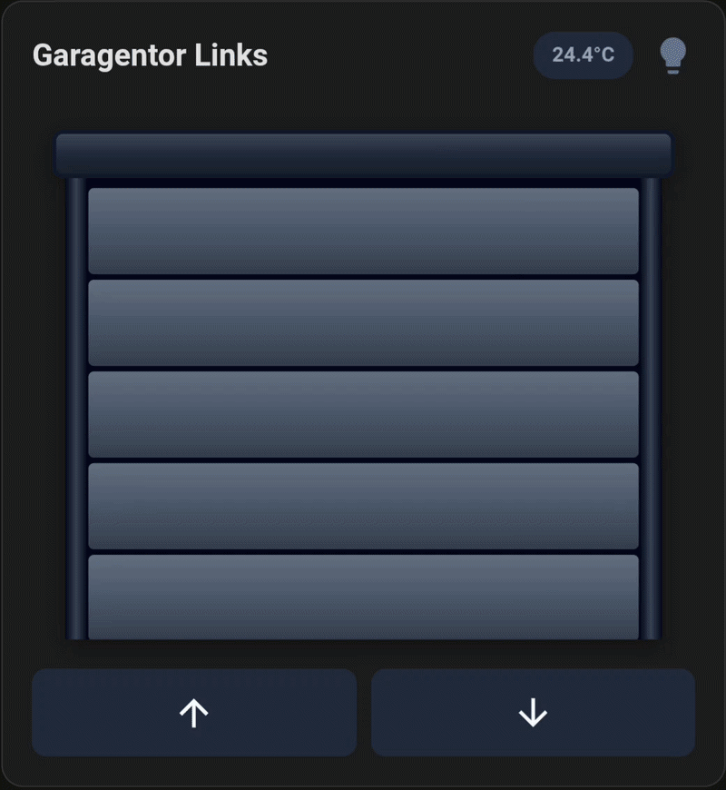
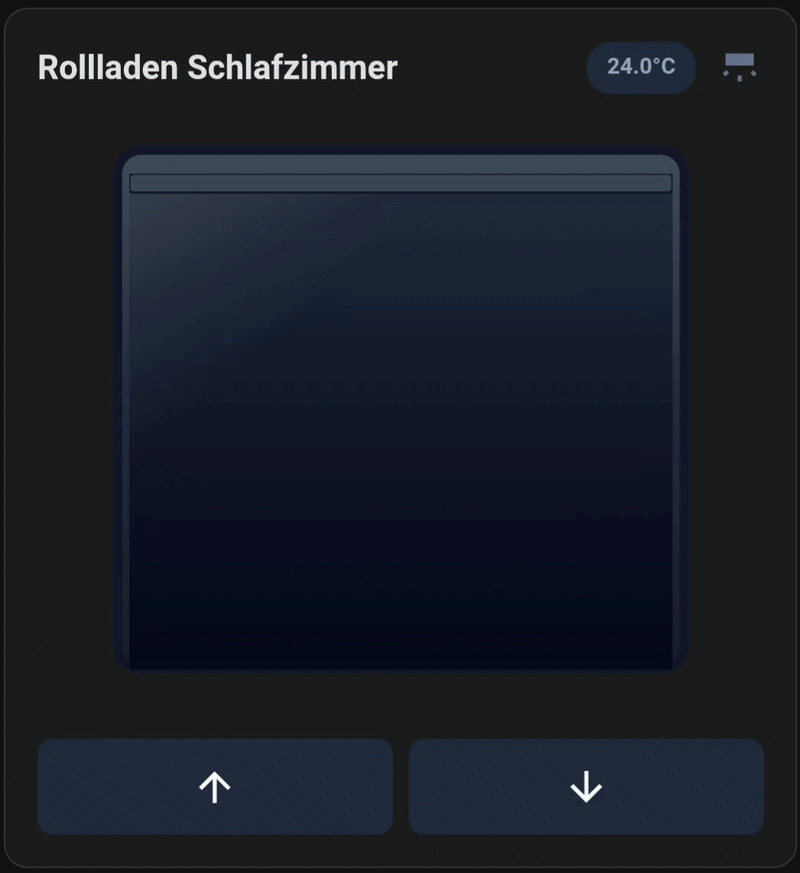
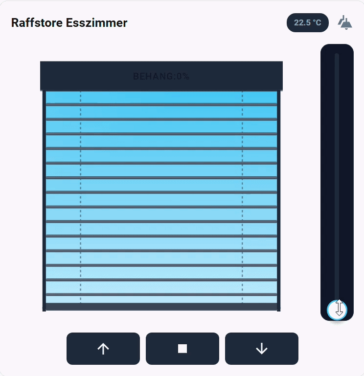
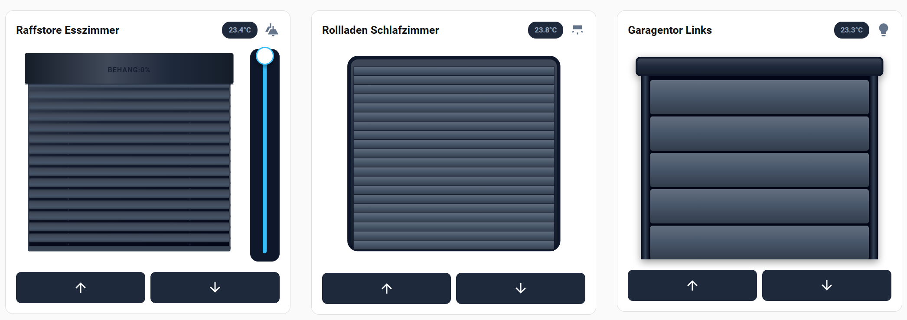

# Realistic Cover Card für Home Assistant

Eine hochwertige, interaktive und animierte Custom Card für Home Assistant zur Steuerung von Rollläden, Raffstores und Garagentoren. 

Die Karte nutzt fortschrittliche SVG-Renderings, um den aktuellen Status und die Bewegung deiner Abdeckungen in Echtzeit darzustellen, und reagiert dynamisch auf deine Umgebung (z.B. Sonnenstand und Raumlicht).

## 🎬 Vorschau

Hier sind die verschiedenen Darstellungsmöglichkeiten der Karte:

| Garagentor | Rollladen | Raffstore |
|:---:|:---:|:---:|
|  |  |  |



## ✨ Features

* **3 unterstützte Typen:** Garagentor, Rollladen und Raffstore (inkl. Lamellen-Neigung).
* **Interaktive Steuerung:** Wische (Drag) den Behang direkt in der Grafik hoch und runter, um die Position einzustellen.
* **Dynamischer Sonnen-Hintergrund:** Die Karte liest automatisch die Entität `sun.sun` aus. Der Himmel im Fensterhintergrund färbt sich stufenlos vom strahlenden Blau (Tag) über Orange (Dämmerung) bis hin zu Dunkelblau/Schwarz (Nacht).
* **Raumlicht-Spiegelung (Glow):** Verknüpfe eine Licht-Entität mit der Karte. Wenn das Licht im Zimmer brennt, spiegelt sich ein warmer "Glow" im Fensterglas.
* **More-Info Dialog:** Ein Klick auf die Karte öffnet den Standard-Einstellungsdialog der Cover-Entität.
* **Anpassbare Buttons:** Blende Haupt-Buttons (Auf/Zu), einen Stop-Button und einen dedizierten Lüftungs-Button (mit definierbarer Zielposition) nach Belieben ein oder aus.
* **Visueller Editor:** Vollständige Integration in den Home Assistant Card Picker UI-Editor. Kein YAML-Code zwingend erforderlich!
* **100% Anpassbar:** Ändere die Farben von Rahmen, Behang, Fensterhintergrund und Buttons oder schalte den 3D-Schatten-Effekt um.

## 📦 Installation (über HACS)

1. Öffne Home Assistant und navigiere zu **HACS** > **Frontend**.
2. Klicke oben rechts auf das Drei-Punkte-Menü und wähle **Benutzerdefinierte Repositories**.
3. Füge die URL dieses Repositories ein und wähle die Kategorie **Lovelace**.
4. Klicke auf **Hinzufügen**.
5. Suche in HACS nach *Realistic Cover Card* und klicke auf **Herunterladen**.
6. Lade dein Dashboard neu (oder leere den Cache deines Browsers).

## ⚙️ Konfiguration

Du kannst die Karte ganz einfach über den visuellen Editor in Home Assistant hinzufügen. Wähle dazu beim Hinzufügen einer neuen Karte **"Realistic Cover"** aus der Liste aus.

### Optionen im Editor

* **Titel:** Die Überschrift der Karte.
* **Haupt-Entität:** Deine `cover.*` Entität.
* **Art der Abdeckung:** Wähle zwischen *Garagentor*, *Rollladen* und *Raffstore*.
* **Behanghöhe / Neigung invertieren:** Falls deine Entität 0% als "Offen" interpretiert, kannst du das Verhalten hier umkehren.
* **Licht / Schalter (Optional):** Für die Raumlicht-Spiegelung im Fenster.
* **Sensor / Kontakt (Optional):** Zeigt den Status eines zusätzlichen Fenster- oder Torkontakts als kleinen Text-Badge an.
* **Sichtbarkeit:** Schalte Status-Texte, Auf/Zu-Buttons, Stop-Buttons oder den Lüftungs-Button individuell ein.
* **Drag-Steuerung deaktivieren:** Deaktiviert das Wischen in der Grafik, falls du nur die Tasten nutzen möchtest.
* **Farben:** Individuelle Color-Picker für Rahmen, Behang, Fenster und Buttons inkl. Reset-Funktion. Wird die Fensterfarbe auf Standard (leer) gesetzt, greift automatisch der Himmels-Farbverlauf der Sonne.

### Manuelle YAML-Konfiguration (Optional)

Falls du YAML bevorzugst, hier ein Beispiel-Code:

```yaml
type: custom:realistic-cover-card
entity: cover.wohnzimmer_ost
title: Wohnzimmer Ost
cover_type: shutter
light_entity: light.wohnzimmer_decke
sensor_entity: binary_sensor.fensterkontakt_ost
show_stop_button: true
show_vent_button: true
vent_percentage: 15
use_3d_colors: true